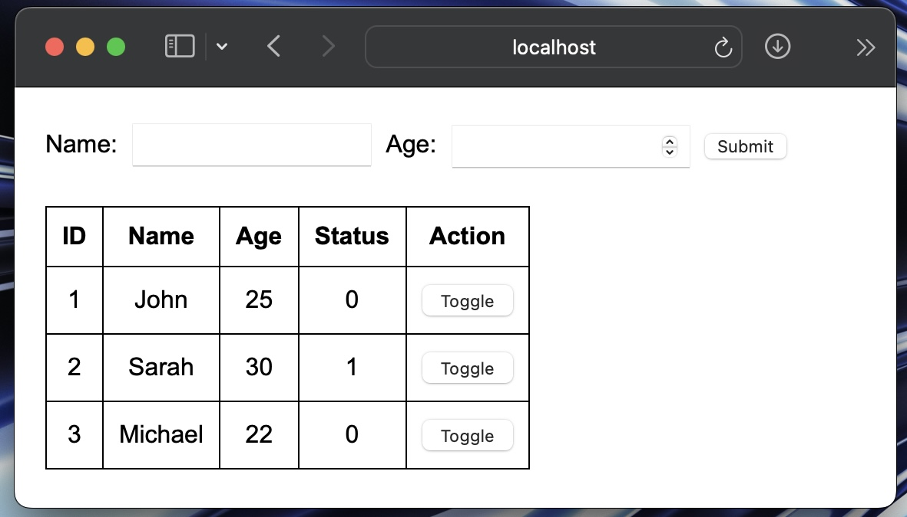

# User Form with Toggle Status

This project is a simple PHP + MySQL web application that:
- Displays a one-line form to input **Name** and **Age**.
- Saves the submitted data into a MySQL database.
- Displays all records in a table below the form.
- Allows toggling the `status` value (0 or 1) for each record in real-time.

---

## Requirements
- **MAMP Pro** or any local server with PHP & MySQL support.
- PHP.
- MySQL database.

---

## Technologies Used

- HTML
- PHP
- MySQL

---

## Installation Steps

### 1️⃣ Place Project Files
1. Open **MAMP Pro**.
2. Check the **Site Folder / Document Root** path for the host.
3. Copy the project files into this folder.

---

### 2️⃣ Create Database and Table
1. Start the Apache and MySQL servers in MAMP Pro.
2. Open [phpMyAdmin](http://localhost:8888/phpMyAdmin) in the browser.
3. Create a new database:
   ```sql
   CREATE DATABASE user_db;
4. CREATE TABLE users (
    id INT AUTO_INCREMENT PRIMARY KEY,
    name VARCHAR(100),
    age INT,
    status TINYINT DEFAULT 0
);

---

### 3️⃣ Configure Database Connection
In index.php, update the database connection line if your MySQL username, password, or port are different:
```
$conn = new mysqli("localhost", "root", "root", "user_db", 8889);
```
 • Default MAMP MySQL username: root
 • Default MAMP MySQL password: root
 • Default MAMP MySQL port: 8889

 ---
 ### 4️⃣  Run the Project
1. Open http://localhost:8888 in the browser.
2. Add a new user (Name + Age).
3. View records in the table below.
4. Use the Toggle button to switch the status between 0 and 1.

---

## 📸 Screenshot


